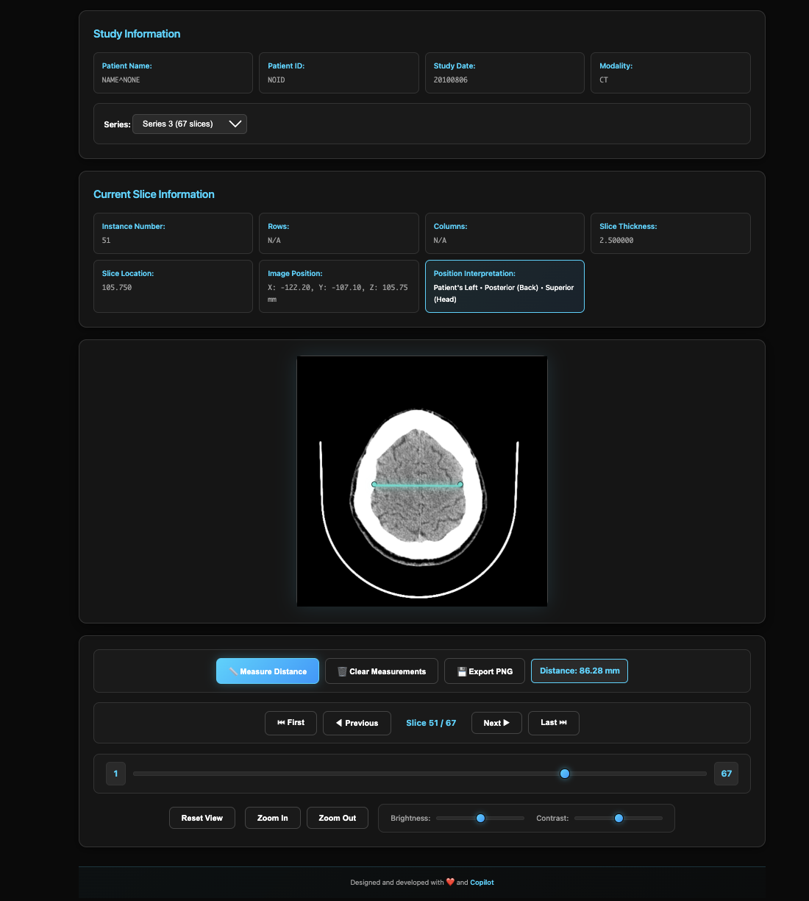

# MRI DICOM Viewer

A web-based application for viewing MRI scans from DICOM (.dcm) files. This application provides an intuitive interface to upload, view, and interact with medical imaging files directly in your browser.



## Features

- 📁 **Single File Upload**: Upload individual DICOM (.dcm) files
- 📂 **Directory Upload**: Upload entire study folders with multiple series
- 🔢 **Multi-Series Support**: Automatically organizes and displays multiple series from a study
- 🎞️ **Slice Navigation**: Navigate through multiple slices/layers within each series
- ⌨️ **Keyboard Controls**: Use arrow keys to quickly navigate between slices
- 🖼️ **Image Rendering**: High-quality medical image visualization using Cornerstone.js
- 🔍 **Zoom & Pan**: Mouse wheel zoom and click-drag panning
- 🎚️ **Brightness/Contrast**: Adjustable window level controls
- 📊 **Metadata Display**: View patient information, study details, and image properties
- 🎯 **Interactive Controls**: Reset, zoom in/out buttons for easy navigation

## Technology Stack

- **Frontend**: HTML5, CSS3, JavaScript (ES6+)
- **DICOM Library**: Cornerstone.js for medical image rendering
- **DICOM Parser**: dicom-parser for DICOM file parsing
- **Build Tool**: Vite for fast development and optimized builds

## Quick Start

### Option 1: Node.js Development Version

For developers who want to modify the code with hot-reload:

#### Prerequisites

- **Node.js** (version 14 or higher)
- **npm** (comes with Node.js)

Check if you have Node.js installed:
```bash
node --version
npm --version
```

#### Installation

1. **Install dependencies**:
   ```bash
   npm install
   ```

2. **Start development server**:
   ```bash
   npm run dev
   ```

The application will open at `http://localhost:3000`

#### Build for Production

```bash
npm run build    # Creates optimized build in dist/
npm run preview  # Preview the production build
```

### Option 2: Docker

Run the application in a Docker container (no Node.js installation required):

#### Using Docker Compose (Recommended)

1. **Start the application**:
   ```bash
   docker-compose up
   ```

2. **Access the application**:
   Open `http://localhost:3000` in your browser

3. **Stop the application**:
   ```bash
   docker-compose down
   ```

#### Using Docker directly

1. **Build the image**:
   ```bash
   docker build -t mri-viewer .
   ```

2. **Run the container**:
   ```bash
   docker run -p 3000:3000 -v $(pwd):/app -v /app/node_modules mri-viewer
   ```

3. **Access the application**:
   Open `http://localhost:3000` in your browser

**Docker Benefits**:
- No Node.js installation required
- Consistent environment across different machines
- Easy to deploy and share
- Isolated dependencies

## How to Use

### Single File Mode

1. **Start the Application**:
   - Run `npm run dev` to start the development server
   - The application will open in your browser

2. **Upload a Single DICOM File**:
   - Click on the "Single DICOM File" upload box
   - Select a .dcm file from your computer
   - The MRI scan will be displayed immediately

### Directory/Study Mode

1. **Upload a Study Directory**:
   - Click on the "Study Directory" upload box
   - Select a folder containing your DICOM series (e.g., study1/)
   - The folder structure can be organized like:
     ```
     study1/
     ├── Series1/
     │   ├── INST1.dcm
     │   ├── INST2.dcm
     │   └── INST3.dcm
     ├── Series2/
     │   ├── INST1.dcm
     │   └── INST2.dcm
     └── Series3/
         ├── INST1.dcm
         ├── INST2.dcm
         └── INST3.dcm
     ```

2. **Navigate Between Series**:
   - Use the Series dropdown to switch between different series (Series1, Series2, etc.)
   - Each series shows the number of slices it contains

3. **Navigate Through Slices**:
   - **Buttons**: Use First/Previous/Next/Last buttons
   - **Slider**: Drag the slice slider for quick navigation
   - **Keyboard**: Use Arrow Up/Right for next slice, Arrow Down/Left for previous slice
   - **Mouse Wheel**: Scroll through slices (when viewing multiple slices)

### Image Interaction

4. **View the Image**:
   - Once loaded, the MRI scan will be displayed
   - Patient information and metadata will appear above the image
   - Current slice information is shown below the series selector

5. **Interact with the Image**:
   - **Zoom**: Use mouse wheel or the zoom in/out buttons
   - **Pan**: Click and drag the image to move it around
   - **Adjust Brightness**: Use the brightness slider
   - **Adjust Contrast**: Use the contrast slider
   - **Reset View**: Click the "Reset View" button to restore original settings

## Project Structure

```
mri_test/
├── .github/
│   └── copilot-instructions.md      # Project setup instructions
├── src/                             # Modular JavaScript source files
│   ├── state.js                     # Application state management
│   ├── domElements.js               # DOM element references
│   ├── dicomLoader.js               # DICOM file loading & parsing
│   ├── seriesManager.js             # Series & slice navigation
│   ├── metadata.js                  # Metadata display functions
│   ├── imageInteraction.js          # Pan, zoom, mouse interaction
│   ├── measurements.js              # Distance measurement tools
│   ├── viewControls.js              # Brightness, contrast controls
│   └── uiHelpers.js                 # UI utility functions
├── index.html                       # Main HTML (Node.js version)
├── main.js                          # Main entry point (ES6 modules)
├── style.css                        # Application styling
├── vite.config.js                   # Vite build configuration
├── package.json                     # Dependencies and scripts
├── Dockerfile                       # Docker container configuration
├── docker-compose.yml               # Docker Compose setup
├── .dockerignore                    # Docker ignore rules
├── .gitignore                       # Git ignore rules
└── README.md                        # This documentation
```

## Key Features Explained

### Directory Structure Support

The application automatically:
- Scans uploaded folders for all .dcm files
- Groups files by Series Instance UID
- Sorts slices by Instance Number within each series
- Displays organized series in a dropdown selector

### Navigation Controls

- **Series Selector**: Switch between different MRI series
- **Slice Navigation Buttons**: Move through slices one by one
- **Slice Slider**: Jump to any slice quickly
- **Keyboard Shortcuts**: 
  - ↑ / → : Next slice
  - ↓ / ← : Previous slice

## Troubleshooting

### npm install fails

If you encounter network errors during installation:

1. **Check your internet connection**
2. **Clear npm cache**:
   ```bash
   npm cache clean --force
   npm install
   ```


### DICOM file won't load

- Ensure the file is a valid DICOM (.dcm) format
- Check browser console for error messages (F12 -> Console tab)
- Some DICOM files may have transfer syntaxes that aren't supported
- Verify the files are not corrupted

### Directory upload not working

- Make sure you're selecting the entire study folder
- Your browser must support the directory upload feature (all modern browsers do)
- Check that the folder contains .dcm files
- Files in nested folders will be found automatically

### Can't see all series

- Verify that each series has a unique Series Instance UID in the DICOM metadata
- Check browser console for any parsing errors
- Some files might be corrupted or invalid

### Browser compatibility

This application works best in modern browsers:
- Chrome/Edge (recommended)
- Firefox
- Safari

## Deployment Options

### 1. Docker Deployment

Push your Docker image to a registry and deploy to:
- Docker Swarm
- Kubernetes
- AWS ECS
- Google Cloud Run
- Azure Container Instances

### 2. Traditional Web Server

Build and deploy the production files:
```bash
npm run build
```
Then serve the `dist/` folder with Nginx, Apache, or any web server.

## Support

For issues or questions, please refer to the documentation of the underlying libraries:
- [Cornerstone.js Documentation](https://docs.cornerstonejs.org/)
- [Vite Documentation](https://vitejs.dev/)
- [Docker Documentation](https://docs.docker.com/)

---

**Designed and developed with ❤️ and Copilot** you can find sample files at:
- [DICOM Library](https://www.dicomlibrary.com/)
- [Medimodel](https://medimodel.com/sample-dicom-files/human_skull_2_dicom_file/)

## License

MIT
